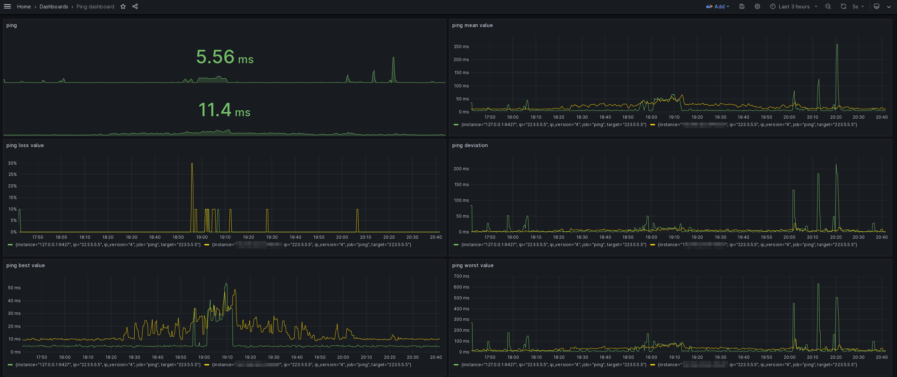

# ping dashboard
This dashboard displays the Internet connection status to the DNS server at 223.5.5.5.

# screenshot




# build
## ping_exporter

Run this repo:   https://github.com/czerwonk/ping_exporter 
```bash
wget https://github.com/czerwonk/ping_exporter/releases/download/1.1.0/ping_exporter_1.1.0_linux_amd64.tar.gz
tar -xzf ping_exporter_1.1.0_linux_amd64.tar.gz
./ping_exporter_1.1.0_linux_amd64.tar/ping_exporter --ping.interval=5s 223.5.5.5
```

## prometheus

download prometheus and unzip
```
wget https://github.com/prometheus/prometheus/releases/download/v2.45.2/prometheus-2.45.2.linux-amd64.tar.gz
```


edit prometheus.yml
```yaml
global:
  scrape_interval: 15s # Set the scrape interval to every 15 seconds. Default is every 1 minute.
  evaluation_interval: 15s # Evaluate rules every 15 seconds. The default is every 1 minute.
  # scrape_timeout is set to the global default (10s).

# Alertmanager configuration
alerting:
  alertmanagers:
    - static_configs:
        - targets:
          # - alertmanager:9093

# A scrape configuration containing exactly one endpoint to scrape:
# Here it's Prometheus itself.
scrape_configs:
  # The job name is added as a label `job=<job_name>` to any timeseries scraped from this config.
  - job_name: "prometheus"

    # metrics_path defaults to '/metrics'
    # scheme defaults to 'http'.

    static_configs:
      - targets: ["localhost:9090"]

  - job_name: 'ping'
    static_configs:
    - targets: ['127.0.0.1:9427']

```

run prometheus
```bash
./prometheus
```


## grafana

```bash
docker run --name grafana -p3000:3000 grafana/grafana
```

add datasource and import dashboard by [this json file](./grafana.json)